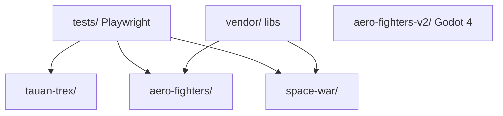

## Visão geral

O repositório tauan-games é um portfólio de jogos independentes, organizados por uma
ladder de quatro engines de complexidade crescente. Cada jogo vive em uma pasta isolada
na raiz do repo e compartilha apenas a infraestrutura transversal de testes Playwright
(`tests/` + `package.json`) e o diretório de libs vendoradas (`vendor/`). Não há
servidor, build pipeline ou orquestração runtime — os artefatos são `index.html` + JS
estático servidos por `npx serve`, e binários Godot 4 standalone.

## Camadas

Ladder das quatro engines — pular degraus ou introduzir uma quinta engine exige decisão
explícita do operador via product-engineer:

| Degrau | Engine | Tipo | Jogo |
|--------|--------|------|------|
| 1 | Phaser.js 3.60 (CDN) | 2D web | `tauan-trex/` |
| 2 | Three.js r165 (vendor local) | 3D web | `aero-fighters/`, `space-war/` |
| 3 | Godot 4.x | 3D desktop indie | `aero-fighters-v2/` (PAUSADO 2026-06-12) |
| 4 | Unreal Engine 5 | 3D desktop AAA | reservado (bloqueado por hardware) |

A ladder é didática: cada degrau ensina conceitos que o anterior não cobre. Emenda
2026-05-18 (ADR-V2-G-02): UE5 deferido a Degrau 4; Godot 4 entrou como Degrau 3 por
restrição de hardware (Ubuntu 24.04 + Iris Xe hostis ao UE 5.5 source build).

Estrutura interna por jogo:

- **Degrau 1 (Phaser):** `index.html` + `game.js` em arquivo único quando possível.
- **Degrau 2 (Three.js):** `index.html` + `src/*.js` em ES modules. Aero Fighters mantém
  ~30 módulos sob `src/` com fronteiras explícitas (`main.js` apenas orquestra; lógica em
  módulos como `player.js`, `missions.js`, `airport.js`, `landing-zones.js`,
  `ground-physics.js`, `physics-core.js`, `sortie-state.js`, `camera-modes.js`,
  `service-scene.js`, `ejection.js`, `nuclear-fx.js`, `maps/*.js`). Vendor local em
  `vendor/three.module.min.js`.
- **Degrau 2 — Space War:** `space-war/src/` separa física de conteúdo: a biblioteca
  `celestial/` (physics puro testável em node, átomos visuais, `CelestialBody` +
  hierarquia `Star` da taxonomia NASA parametrizada por massa, componentes de
  movimento) é consumida por `universe.js` (os 6 sistemas como DADOS) e por
  `campaign.js` (as 5 fases como dados; `missions.js` executa). `gravity.js` e
  `orbits.js` consomem o record canônico dos corpos e não conhecem as classes.
  `ballistics.js` (solver de solução de tiro — puro, testável em node) consome o
  campo via `gravityFn` injetada (= `computeGravity`) e serve `ship.js` (mira C),
  `nav.js` (arco no HUD) e `weapons.js` (nuke `aimed` sob gravidade pura).
  `celestial/physics.js` concentra as leis puras node-testáveis (fotometria de fonte
  pontual, perfis de viagem brachistochrone e trapezóide 30/40/30, gauges de escala);
  `journey.js` (autopilot interestelar T/O/Z) e `starfield.js` (corredor galáctico em
  quads instanciados com relatividade no vertex shader) as consomem, e
  `celestial/starlod.js` faz o LOD ponto↔disco + glows de sistema por cima da mesma
  fotometria.
- **Degrau 3 (Godot 4):** `aero-fighters-v2/` — scene tree + GDScript + Autoload
  singletons; export Linux x64 via Godot CLI. Trabalho pausado em 2026-06-12.

## Regras de dependência

- Proibido: um jogo depender de outro jogo (acoplamento horizontal entre pastas).
- Permitido: jogos consumirem `vendor/`; `tests/` consome cada jogo para validação.

## Restrições e proibições

- Governance SDD vive em `specs/` (pattern-1 desde 2026-06-12): `constitution.md`,
  `memory/*.md` (atoms Markdown), `backlog/`, `releases/` + `ACTIVE.md`,
  `_archive/releases/`.
- Memory atoms são Markdown; HTML legado foi removido na migração de 2026-06-12.
