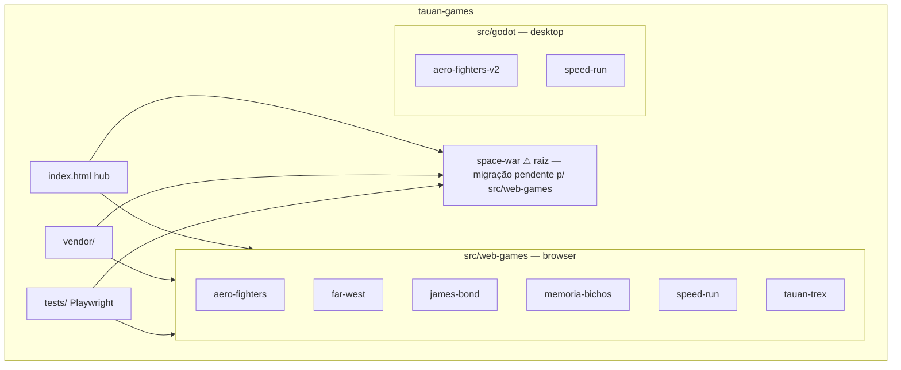
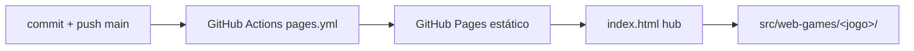
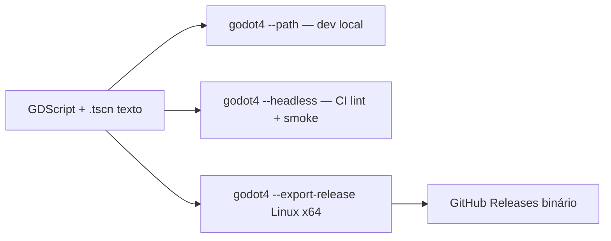

## Visão geral

O repositório tauan-games é um portfólio de jogos independentes classificados **por
tecnologia** em dois grupos dentro de `src/`: **`src/web-games/`** (jogos de browser —
Three.js, Phaser ou DOM puro, 100% estáticos, sem build) e **`src/godot/`** (jogos
desktop nativos em Godot 4). Infra transversal: `vendor/` (libs/modelos offline),
`tests/` (Playwright), `index.html` (hub público), `.github/workflows/` (CI + deploy).

Regras de dependência: proibido jogo importar jogo (acoplamento horizontal);
permitido consumir `vendor/`; `tests/` consome cada jogo web. Jogos Godot são
autocontidos (assets copiados para dentro do projeto — `res://` não enxerga fora).

---

## MACRO 1 — Arquitetura dos web-games (`src/web-games/`)

**Padrão comum**: `index.html` + ES modules em `src/` (ou `game.js` único nos
degraus 0-1), Three.js r165 vendorizado importado por caminho relativo
(`../../../../vendor/three.module.min.js` a partir de `src/<grupo>/<jogo>/src/`),
zero build step, zero fetch externo. Estado de debug em `window.*` para testes.
Modelos GLB CC0 (Quaternius via poly.pizza) em `vendor/models/` com licenças em
`vendor/models/LICENSES.md`.

### Deploy e publicação (web)

- **Local**: `python3 -m http.server 8080` (ou `npx serve`) na **raiz do repo**;
  abrir `http://localhost:8080/src/web-games/<jogo>/`.
- **Público**: GitHub Pages via `.github/workflows/pages.yml` (build_type=workflow)
  publica o repo inteiro como site estático; o hub `index.html` na raiz lista um
  card por jogo. URL de produção: página do repositório no GitHub Pages.
- Requisitos do usuário final: qualquer browser moderno com WebGL2; nada é instalado.

### aero-fighters (Three.js — Degrau 2)

Combate aéreo em 3ª pessoa: F-35 em missões de ataque ao solo (bases, fábricas,
comboios) defendidas por AA. ~30 módulos ES com fronteiras explícitas: `main.js`
orquestra; lógica em `player.js`, `missions.js`, `airport.js`, `ground-physics.js`,
`physics-core.js`, `camera-modes.js`, `ejection.js`, `maps/*.js` (incl. mapa GIS de
Inhaúma-MG com pontes/rios/estradas autorais). Docs próprios: `ARCHITECTURE.md`,
`CONVENTIONS.md`, `AGENTS.md`.

### far-west (Three.js — Degrau 2)

Faroeste open-world 2048×2048 m procedural: cowboy a cavalo, montanhas, florestas,
2 rios com vaus e pontes, lago; caça (veados), captura de bandidos. Pipeline de
mundo determinístico: `noise.js` (simplex seeded) → `rivers.js` (polylines
descendo p/ lago) → `heightfield.js` (grid 2 m, contrato `heightAt/normalAt/
slopeAt/moistureAt`) → chunks LOD. `state.js` = `window.game` fonte única;
`config.js` centraliza TODAS as constantes. Em desenvolvimento ativo
(release `far-west-character-v1`).

### james-bond (Three.js — Degrau 2)

FPS de espionagem inspirado nos shooters de 1997, 6 operações (Barragem Alpina,
Complexo Químico, Relay Congelado, Silo de Mísseis, Fragata Sequestrada, Controle
na Selva). Colisão AABB determinística, navegação dos guardas via Yuka (A*),
áudio sintetizado por Web Audio (Howler vendorizado p/ evolução), materiais PBR
procedurais, auto-degradação de qualidade em GPU fraca (55% resolução, 30 Hz).

### memoria-bichos (DOM puro — Degrau 0)

Jogo da memória infantil em HTML/CSS/JS puro (sem canvas): níveis por quantidade
de pares, cartas de animais viradas por clique/toque, acessível a criança pequena.
Arquivo único `game.js` + `styles.css`.

### speed-run (Three.js — Degrau 2)

Corrida arcade estilo Cruis'n World (N64): 3 pistas (Centro Urbano, Floresta
Temperada, Deserto do Arizona) declarativas em `tracks.js` (spline Catmull-Rom,
superfícies asfalto/terra/offroad com atrito distinto), 5 carros GLB Quaternius
(incl. Fiat Idea Adventure 2013 Dual Logic), física própria em `physics.js`
(colisão elástica com massas reais, capotamento, ré), tráfego civil, texturas
procedurais canvas (era PS1: low-poly + textura rica). Rig de rodas GLB com pivô
recentrado no cubo. Versão irmã em Godot: `src/godot/speed-run`.

### tauan-trex (Phaser 3 — Degrau 1)

Clone aprimorado do Chrome Dino: pular cactos, abaixar sob pterodátilos,
dificuldade progressiva. `game.js` único sobre `vendor/phaser.min.js`.

### space-war (Three.js — Degrau 2) — ⚠ ainda na raiz, migração pendente

Combate/exploração espacial com física real documentada: 6 sistemas estelares
(dados em `universe.js`), biblioteca `celestial/` pura e testável em node
(taxonomia NASA de estrelas por massa, gravitação, órbitas Kepler), balística
sob gravidade (`ballistics.js` com `gravityFn` injetada), campanha de 5 fases,
viagem interestelar com aberração relativística (`starfield.js`, teto visual
β=0.90 documentado), buraco negro Sgr A*. Migra para `src/web-games/space-war`
quando a sessão concorrente liberar os arquivos.

---

## MACRO 2 — Arquitetura dos jogos Godot (`src/godot/`)

**Padrão comum**: Godot 4.7.1 (binário oficial Linux x86_64 em
`~/.local/opt/godot`, symlink `~/.local/bin/godot4`), Forward+ renderer, cenas em
formato **texto** (`.tscn`) e GDScript — operável 100% por CLI/arquivos, sem
editor GUI. Cache de import (`.godot/`) é gitignored. Assets de terceiros CC0
copiados para dentro do projeto (`assets/`), pois `res://` não acessa `vendor/`.

### Deploy e publicação (Godot)

- **Local (dev)**: `godot4 --path src/godot/<jogo>` roda o jogo na hora.
- **Headless/CI**: `godot4 --headless --import` (cache de assets) e modos de teste
  por env var com exit code (ex.: `CORRIDA_TEST=1`).
- **Público**: export desktop Linux x64 via Godot CLI (`--export-release`) →
  binário standalone distribuído em GitHub Releases. **Export web (WASM) foi
  avaliado e descartado** como alvo primário: performance documentadamente fraca
  (200 fps desktop → 15-20 no browser) — decisão 2026-07-18.
- Requisitos do usuário final: Linux x64 com Vulkan (roda em Intel Iris Xe);
  nenhuma instalação além do binário.

### speed-run (Godot 4)

Corrida com física de veículo REAL da engine: `VehicleBody3D` + 4
`VehicleWheel3D` (suspensão raycast, atrito de pneu, transferência de peso).
Construção 100% procedural em GDScript: `race.gd` monta mundo (Curve3D fechada
→ pista ribbon + colisor trimesh + guard-rails com colisão + terreno heightfield
que SEGUE a elevação da pista), `car_factory.gd` monta carros dos GLB Quaternius
(rig de roda: pivô no cubo via AABB, espelho por rotação 180° — nunca escala
negativa). Iluminação real: sol com sombras, céu procedural, névoa, tonemap
FILMIC. 1 jogador + 3 IA seguidoras de spline. Convenção MEDIDA empiricamente
(tests/probe.gd): `engine_force` positivo = ré neste rig — frente usa força
negativa. Testes: `CORRIDA_TEST=1` (headless, mede avanço real no sentido da
corrida) e `CORRIDA_SHOT=<dir>` (captura screenshots do viewport p/ validação
visual em Wayland).

### aero-fighters-v2 (Godot 4)

Combate aéreo cel-shaded sobre recriação estilizada de Inhaúma-MG: footprints de
prédios do OpenStreetMap + elevação SRTM (mirror AWS), shader cel próprio
(`CelShaderPass`), AA guns, física de voo própria. Scene tree + Autoloads;
CI lint-only no GitHub Actions (`aero-v2-godot-ci.yml`: gdlint, validade de
cenas headless, flake8 nos tools Python, verificação Git LFS). Wave 1 completa,
Wave 2 em progresso (histórico: pausado 2026-06-12, retomado com a migração p/
`src/godot/` em 2026-07-18).

---

## Requisitos de desenvolvimento (ambos os grupos)

| Item | web-games | godot |
|---|---|---|
| Runtime dev | Node 20+ (Playwright), servidor estático | Godot 4.7.1 CLI |
| GPU | WebGL2 (Iris Xe ok) | Vulkan (Iris Xe ok) |
| Build | nenhum | import cache + export CLI |
| Assets | `vendor/` compartilhado | `assets/` por projeto |
| Debug por agente | `window.*` + Playwright MCP | env vars + exit codes + screenshots de viewport |
