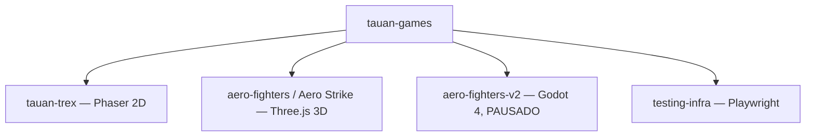

## Visão atômica

Repositório de jogos e experimentos interativos — espaço pessoal de aprendizado e
criação. Hospeda dois jogos web jogáveis (`tauan-trex` e `aero-fighters`, nome visível
"Aero Strike") e a infraestrutura compartilhada de testes Playwright. Detalhes em
[[overview]], [[games-catalog]] e [[quality-bar]].

## Usuários

| Usuário | Descrição |
|---------|-----------|
| Tauan | Filho do operador (criança) — público real e recorrente; filtra todas as decisões de produto. |
| Operador (papai) | Uso pessoal, aprendizado e portfólio futuro. |

## Catálogo de features

| Slug | Título | TL;DR |
|------|--------|-------|
| overview | Identidade do produto | O que é o tauan-games e para quem. |
| games-catalog | Catálogo de jogos | Jogos/experimentos ativos e seus status. |
| quality-bar | Barra de qualidade | Objetivos de produto e critérios não-negociáveis. |

## Mapa de capacidades

## Limites conhecidos

- `aero-fighters-v2` (Godot) está pausado desde 2026-06-12; o foco é o uplift do jogo
  web `aero-fighters/` (release `aero-fighters-uplift-v1`).
- O jogo foi originalmente implementado por um agente fraco (DeepSeek); a qualidade é
  aceitável mas o operador exige uplift de mapas, mecânicas, decolagem/aterrissagem,
  explosões e realismo de colisão.
