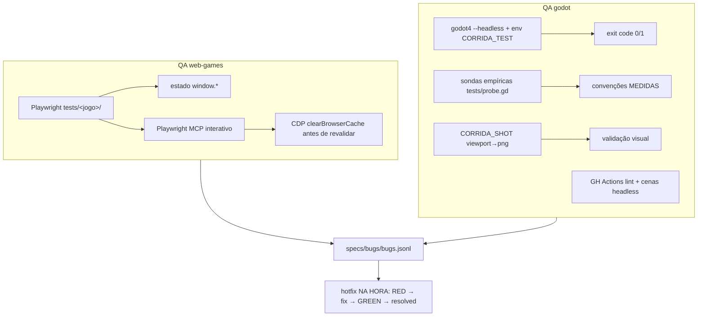

## Visão geral

Dois trilhos de QA, um por grupo de tecnologia, com leis comuns:

- **Anti-slop**: sem teste fabricado que só espelha a implementação; todo teste
  valida comportamento observável (AC do SPEC). Métrica de teste deve ser
  IMUNE a falso-positivo (ex.: speed-run Godot mede avanço REAL no sentido da
  corrida — andar de ré desconta; a métrica antiga passava com o carro de ré).
- **Offline obrigatório**: vendor local, zero CDN nos testes.
- **Validação visual é DE PERTO e EM MOVIMENTO**: bug de roda-orbitando só
  aparece com câmera lateral colada no carro andando; screenshot de longe mente.
- **Critério de jogabilidade** (ver [[quality-bar]]): sem loading visível, sem
  erros de console, controles descobertos em segundos.

## Rastreio de bugs (ambos os grupos)

- Ledger event-sourced `specs/bugs/bugs.jsonl` (`dadaia bugs append`).
- **Doutrina hotfix**: bug NUNCA vira release — registra, reproduz na causa raiz,
  teste RED, fix, GREEN, evento `resolved` com evidência, na mesma sessão.
- Bug visual exige screenshot de reprodução e screenshot de prova pós-fix.

---

## MACRO 1 — QA dos web-games

**Estratégia**: suíte Playwright transversal em `tests/<jogo>/` rodando contra
servidor estático local (config em `tests/playwright.config.js`; globalSetup sobe
o servidor). Porta padrão 8080; sessões concorrentes usam `TEST_PORT` alternativa
(ex.: 8093) para não colidir. Jogos expõem estado de debug em `window` e os testes
o inspecionam via `page.evaluate`; IA pode dirigir o jogador
(`G.player.isPlayer=false` + `st.ai={...}`) para validar percurso sem input.

Gotchas de método (aprendidos e obrigatórios):
- Playwright MCP cacheia módulos ES — SEMPRE `Network.clearBrowserCache` via CDP
  antes de revalidar um edit.
- Máquina saturada gera falso vermelho em massa (18 min/6 testes) — rerun limpo
  antes de diagnosticar.
- `cmd | tail` mascara exit code — validar `PIPESTATUS`/exit real.

### Por jogo (web)

- **aero-fighters** — `tests/aero-fighters/`: smokes + QA de missão
  (`npm run test:aero:qa`); diagnósticos de estrada/GIS no próprio jogo
  (`inhauma-road-diagnostics.js`).
- **far-west** — `tests/far-west/`: smoke de mundo (rios monotônicos, vaus,
  heightfield `heightAt` == malha renderizada); release ativa usa sessão própria
  na porta 8080.
- **james-bond** — `tests/james-bond/`: smoke por operação, `window.game` para
  estado; auto-degradação de qualidade testada em GPU por software.
- **memoria-bichos** — `tests/memoria-bichos/`: fluxo completo de nível, pares,
  acessibilidade de clique/toque, navegação a partir do hub.
- **speed-run (web)** — `tests/corrida/`: menu (3 pistas/5 carros/Idea presente),
  corrida por pista com IA dirigindo (racers=6, traffic=4, superfície válida),
  ordenação de atrito das superfícies. `TEST_PORT=8093`.
- **tauan-trex** — `tests/trex/`: ACs numerados (score após 3 s, FPS ≥ 55 em 10 s).
- **space-war** (raiz, migração pendente) — `tests/space-war/`: specs de journey/
  fotometria do starfield; biblioteca `celestial/` testável em node puro.

---

## MACRO 2 — QA dos jogos Godot

**Estratégia**: três camadas.

1. **Sonda empírica** (`tests/probe.gd` + `probe.tscn`): NUNCA confiar em
   convenção documentada — medir (ex.: sinal do `engine_force` do
   `VehicleBody3D`: positivo = ré neste rig, o oposto do doc). Toda convenção
   física usada em produção referencia a sonda que a mediu.
2. **Smoke headless com exit code**: `CORRIDA_TEST=1 godot4 --headless --path .`
   — IA dirige o jogador; PASS exige avanço real > 80 m no sentido da corrida E
   velocidade à frente > 3 m/s aos 12 s; qualquer falha = exit 1.
3. **Validação visual por screenshot de viewport**: `CORRIDA_SHOT=<dir>` salva
   PNGs em marcos de tempo (Wayland não tem ferramenta CLI de screenshot —
   o próprio jogo captura `get_viewport().get_texture().get_image()`).

CI (GitHub Actions): `aero-v2-godot-ci.yml` — gdlint em todos os `.gd`, validade
de `project.godot`/cenas via Godot headless `--quit`, flake8/black nos tools,
verificação de ponteiros Git LFS. Gates visuais/perf rodam localmente no Iris Xe
do operador (decisão ADR-V2-G-01/02).

### Por jogo (Godot)

- **speed-run (godot)** — `tests/probe.gd` (convenções medidas: engine sign,
  steering, estabilidade em chão plano), smoke `CORRIDA_TEST` com métrica de
  avanço real, screenshots `CORRIDA_SHOT` para terreno/rodas/carros. Gotchas
  cravados: winding de grid invertido = terreno invisível ("chão branco");
  espelhar roda por rotação 180°, nunca escala negativa (winding).
- **aero-fighters-v2** — CI lint-only (workflow acima) + gates visuais/perf
  locais; LFS verificado no CI; cenas validadas headless.
