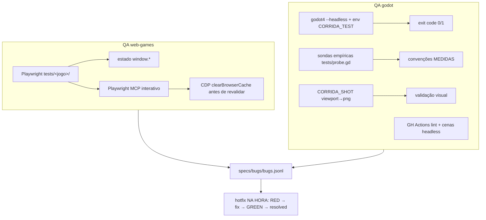

## Visão geral

QA de um único grupo de tecnologia (web-games — Godot removido do repo em
2026-08-11), com leis comuns:

- **Anti-slop**: sem teste fabricado que só espelha a implementação; todo teste
  valida comportamento observável (AC do SPEC). Métrica de teste deve ser
  IMUNE a falso-positivo (ex.: speed-run Godot mede avanço REAL no sentido da
  corrida — andar de ré desconta; a métrica antiga passava com o carro de ré).
- **Offline obrigatório**: vendor local, zero CDN nos testes.
- **Validação visual é DE PERTO e EM MOVIMENTO**: bug de roda-orbitando só
  aparece com câmera lateral colada no carro andando; screenshot de longe mente.
- **Critério de jogabilidade** (ver [[quality-bar]]): sem loading visível, sem
  erros de console, controles descobertos em segundos.

```mermaid
flowchart TB
    subgraph webqa[QA web-games]
        pw[Playwright tests/&lt;jogo&gt;/] --> dbg[estado window.*]
        pw --> mcp[Playwright MCP interativo]
        mcp --> cdp[CDP clearBrowserCache antes de revalidar]
    end
    subgraph godqa[QA godot]
        hl[godot4 --headless + env CORRIDA_TEST] --> exit[exit code 0/1]
        probe[sondas empíricas tests/probe.gd] --> conv[convenções MEDIDAS]
        shot[CORRIDA_SHOT viewport→png] --> visual[validação visual]
        ci2[GH Actions lint + cenas headless]
    end
    webqa --> bugs[specs/bugs/bugs.jsonl]
    godqa --> bugs
    bugs --> hotfix[hotfix NA HORA: RED → fix → GREEN → resolved]
```

## Rastreio de bugs (ambos os grupos)

- Ledger event-sourced `specs/bugs/bugs.jsonl` (`dadaia bugs append`).
- **Doutrina hotfix**: bug NUNCA vira release — registra, reproduz na causa raiz,
  teste RED, fix, GREEN, evento `resolved` com evidência, na mesma sessão.
- Bug visual exige screenshot de reprodução e screenshot de prova pós-fix.

---

## MACRO 1 — QA dos web-games

**Estratégia**: suíte Playwright transversal em `tests/<jogo>/` rodando contra
servidor estático local (config em `tests/playwright.config.js`; globalSetup sobe
o servidor). Porta padrão 8080; sessões concorrentes usam `TEST_PORT` alternativa
(ex.: 8093) para não colidir. Jogos expõem estado de debug em `window` e os testes
o inspecionam via `page.evaluate`; IA pode dirigir o jogador
(`G.player.isPlayer=false` + `st.ai={...}`) para validar percurso sem input.

Gotchas de método (aprendidos e obrigatórios):
- Playwright MCP cacheia módulos ES — SEMPRE `Network.clearBrowserCache` via CDP
  antes de revalidar um edit.
- Máquina saturada gera falso vermelho em massa (18 min/6 testes) — rerun limpo
  antes de diagnosticar.
- `cmd | tail` mascara exit code — validar `PIPESTATUS`/exit real.

### Ciclo de vida de testes (v0.11.0 — doutrina test-stewardship)

- **Pirâmide corrigida em CI**: job `node-gate` no ci.yml roda TODAS as suítes Node
  (26 arquivos — aero qa/unit/sim, space-war unit, corrida unit, jb unit, db unit,
  agregadas em `npm run test:unit`) ANTES da matriz Playwright (`needs: node-gate`).
- **Suíte E2E = 93 casos** (v0.11.0; era 187): aero 30, space-war 31, corrida 14,
  jb 12, db 6. E2E só para o browser-intrínseco (pixels, input real, DOM, áudio,
  renderer.info, persistência); lógica/física/constantes = Node.
- **Rebaixamento é etapa de fechamento**: E2E que validou a feature vira cobertura
  Node com mapa E2E→substituto no CLOSURE; máx. 1 SENTINEL por costura (marcados
  in-file: aero diagnostics reload-identity; space-war three-states-flow).
- **Deleção com evidência**, nunca pelo implementador para ficar verde; 4 deleções
  do mapa v0.11.0 foram REFUTADAS por inspeção e mantidas (jb :617/:816, db :38/:89
  — notas in-file) — verificar em árvore antes de deletar é obrigatório.
- Statements completos: report v2 test-stewardship (workspace,
  `2026-08-12T175304Z-test-stewardship-statements-v2.html`). Fase 2 pendente:
  initScene() lazy destrava 19 demoções restantes (backlog test-value-lifecycle-v1).

### Política de execução da suíte (medida no CI, v0.10.0)

- **workers: 1** — paralelismo medido INVIÁVEL: SwiftShader não tolera 2
  instâncias WebGL no runner (boot starvation de `canvas`, 84/179 falhas).
  Decisão por medição, não preferência; revisitar se a suíte ficar leve.
- **testIgnore + jobs dedicados**: james-bond e demolition-ball rodam fora do
  run raiz, em workflows próprios com `paths` filter (padrão godot-ci); o
  config dedicado do james-bond é auto-suficiente (sobe/derruba o servidor).
  Cobertura exigida: raiz + dedicados ≥ baseline.
- **Run-start clean**: globalSetup remove artefatos do run anterior
  (screenshots/, playwright-report/, test-results/) e pid file de processo
  morto (antes: abortava o run). Teardown garante o pid também em morte
  anormal (try/finally + SIGINT/SIGTERM/exit).
- **Artefato sem consumidor não se escreve**: consumidor válido = upload do
  CI em `if: failure()` ou inspeção local documentada no próprio spec.
- **Polling > sleep**: `waitForTimeout` vira `waitForFunction` sobre estado
  real do jogo; janelas de medição/estabilidade/pulso ficam com justificativa
  escrita no spec (regra da T-07).
- **Retry/timeout**: retries:1 (flake de relógio de parede passa no retry,
  evidência nas runs); timeout 30 s default + orçamento declarado por spec;
  trace+video só no retry.
- **GL/ANGLE**: `PW_GL_ARGS=1` opt-in documentado; default OFF (A/B no CI:
  +20 % de tempo e flare quebrado).

### Por jogo (web)

- **aero-fighters** — `tests/aero-fighters/`: smokes + QA de missão
  (`npm run test:aero:qa`); diagnósticos de estrada/GIS no próprio jogo
  (`inhauma-road-diagnostics.js`).
- **james-bond** — `tests/james-bond/`: smoke por operação, `window.game` para
  estado; auto-degradação de qualidade testada em GPU por software.
- **speed-run (web)** — `tests/corrida/`: menu (3 pistas/5 carros/Idea presente),
  corrida por pista com IA dirigindo (racers=6, traffic=4, superfície válida),
  ordenação de atrito das superfícies. `TEST_PORT=8093`.
- **space-war** (raiz, migração pendente) — `tests/space-war/`: specs de journey/
  fotometria do starfield; biblioteca `celestial/` testável em node puro.

---

## ~~MACRO 2 — QA dos jogos Godot~~ (grupo removido)

Os projetos Godot foram todos removidos do repositório (2026-08-11 — repo
100% web). Fica a lição registrada para um eventual retorno: **sonda
empírica antes de confiar em convenção documentada** (ex.: sinal do
`engine_force` media-se em probe, nunca assumia-se do doc) e smoke headless
com exit code exigindo avanço real no sentido do movimento.
